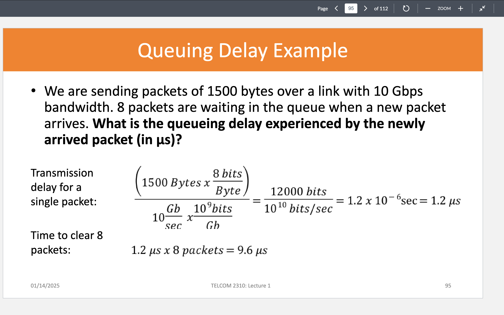
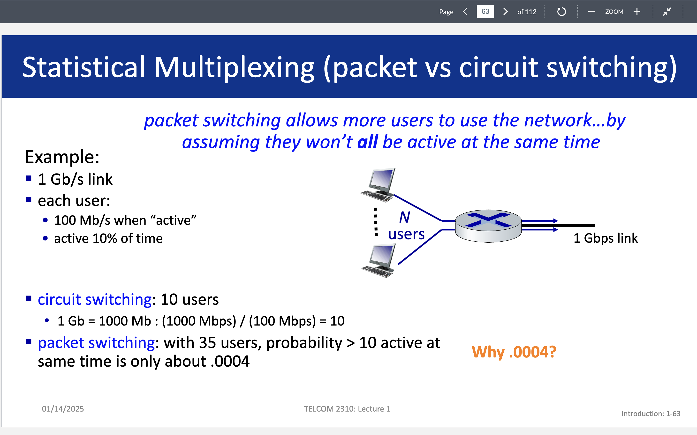
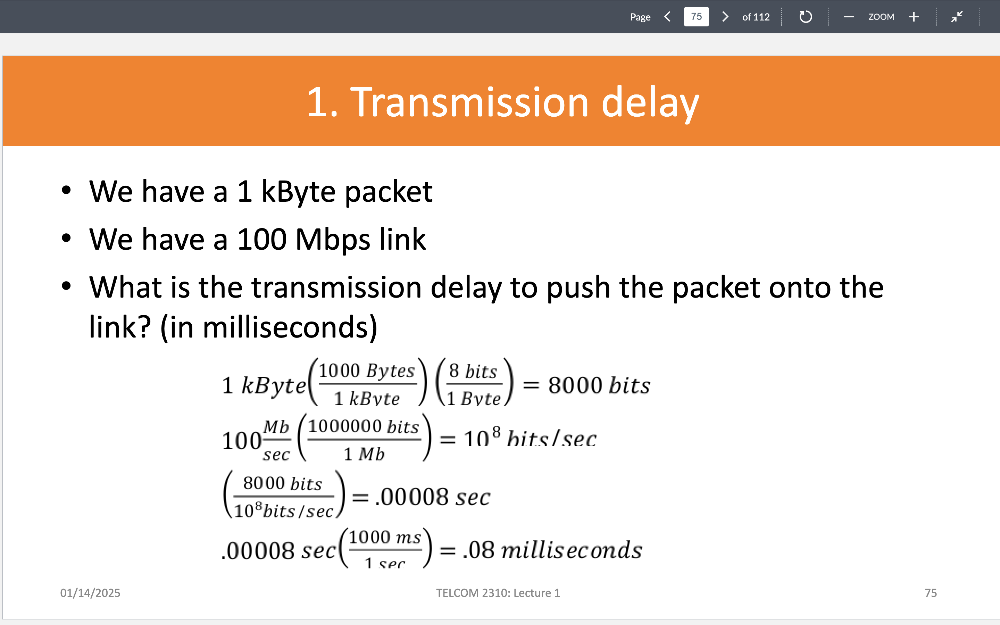
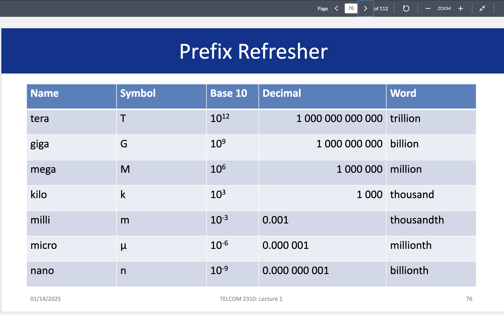

# Application of Networks

## Networks
- Networks consist of **links** that connect **nodes** and can carry information between them.  
- **Nodes** connected in the network are called **hosts** or **end systems**.

## Internet
- Nodes are connected by **packet switches** and **communication links**.  
- Computers connected to a network that participate directly in communication are classified as **hosts**.  
- Devices that users commonly interact with are called **end devices**.  
- **Packet Switching** is a method of transferring data in the form of packets over a network.  
- End systems connect to the Internet through **Internet Service Providers (ISP)**, which are organized in a hierarchy.  
- Information is packaged into chunks of data called **packets**, which traverse a route of links and switches to reach their destination.  
- **Transmission rates** (bandwidth) are measured in bits/sec.

## Applications and Network Layers
- Applications view the Internet as a **black-box infrastructure** providing specific services.  
- Applications access these services through **well-defined interfaces**.  
- Computer networks separate responsibilities into **layers**, where each layer provides services to the one above it.

---

## Protocol
- A protocol is like a **blueprint** that specifies a common format for communication exchange.  
- **In computer networks**, protocols define:  
  - The **format** and **order** of messages sent and received.  
  - Actions taken upon message transmission, receipt, or other events.

---

## Network Edge
- The **network edge** is the point where devices (end-user systems, IoT devices, servers) connect to the network infrastructure.  
- Servers are often housed in **data centers**.

## Physical Medium
- Communication occurs by propagating electromagnetic waves or optical pulses across a physical medium.  
- **Physical media** can be:  
  - **Guided media**: Twisted-pair copper wire, coaxial cable.  
  - **Unguided media**: Wireless LAN, digital satellite channels.

---

## Data Transmission
- Long messages from a source system are broken into smaller **packets** for transmission.  
- Packets travel through **communication links** and **packet switches** from source to destination.  
- **Transmission time for a packet**:  
  ```
  Time = L / R (where L = packet size in bits, R = transmission rate in bits/sec)
  ```

## Store-and-Forward Transmission
- Most packet switches use **store-and-forward transmission**:  
  - The switch must **receive the entire packet** before transmitting the first bit to the outbound link.  
- **End-to-end delay for one packet** across N links:  
  ```
  Delay = N * (L / R)
  ```

---

## Packet Switches
- Each packet switch has multiple links attached, and for each link, an **output buffer (queue)** stores packets waiting for transmission.  

### Packet Loss
- If a packet arrives at a busy link, it waits in the **output buffer** (queueing delay).  
- If the buffer is full, **packet loss** occurs, and either the arriving packet or a queued packet is dropped.

### Packet Forwarding
- The router receives a packet from one link and **forwards** it to another attached communication link.


# Network Sharing Methods

## Two Ways to Share Switched Networks

### 1. Circuit Switching
- **Definition:** End-to-end resources are allocated and reserved for a flow from source to destination. The process involves:
  - The source sends a request to the destination.
  - Switches create circuits after performing admission control.

- **Techniques:**
  - **Time Division Multiplexing (TDM):** Time is divided into slots, and data is sent only during its allocated slot.
  - **Frequency Division Multiplexing (FDM):** Optical or electromagnetic frequencies are divided into bands, and data is sent within a specific narrow band.

- **Phases of Circuit Switching:**
  1. **Circuit Establishment**
  2. **Data Transfer**
  3. **Circuit Teardown**

### 2. Packet Switching
- **Definition:** Data is broken down into smaller chunks called packets. Each packet contains destination information and is treated independently.

- **Advantages:**
  - Simpler to implement.
  - Efficient use of network resources.

- **Disadvantages:**
  - Requires buffer management.
  - Needs congestion control.

---

Here is the content formatted in proper `README.md` syntax:

# Network Performance Metrics

## Key Metrics:
1. **Delay (Latency):** How long it takes for a packet to travel from source to destination.
2. **Loss:** The fraction of packets sent by the source that fail to reach the destination.
3. **Throughput:** The rate at which data is received by the destination.

---

## Delay Components:
1. **Transmission Delay:**  
   Time taken to push all bits of a packet onto the link.  
   **Formula:**  
   ```
   Packet Transmission Delay = L (bits) / R (bits/sec)
   ```
   Where:  
   - `L` is the packet size.  
   - `R` is the link bandwidth.  
     Bandwidth refers to the maximum rate at which data can be transmitted over a network link in a given amount of time.

2. **Propagation Delay:**  
   How long it takes to move one bit from one end of the link to the other.  
   **Formula:**  
   ```
   Propagation Delay = d (meters) / s (meters/sec)
   ```
   Where:  
   - `d` is the link length (distance).  
   - `s` is the propagation speed of the signal in the link medium.  

   **Pipe View:** Transmission delay decreases as the bandwidth increases.

3. **Queueing Delay:**  
   How long a packet has to sit in a buffer before it is processed.  
   - Queueing delay can vary significantly for the same router at different times (based on load).  
   - Typically measured in microseconds (µs) or milliseconds (ms).  

   **Transient Overload:**  
   Refers to a temporary condition where the arrival rate of packets exceeds the service rate of the network device (e.g., a router or switch). This causes packets to queue up, leading to increased delays or even packet drops if the buffer becomes full.  

   **Formula:**  
   ```
   Queueing Delay = Number of Packets * Transmission Delay
   ```

   

4. **Processing Delay:**  
   Time taken by the switch to process a packet.  
   - When a packet arrives at a packet switch, the switch needs to perform some actions before putting it onto the output link.

---

## Nodal Delay:
The total time for a packet to reach the other end of the link.  
**Formula:**  
```
d_nodal = d_proc + d_queue + d_trans + d_prop
```

For the total delay across multiple nodes:  
```
d_end_to_end = N * d_nodal
```

---

## Loss:
- What fraction of packets sent to the destination are dropped?

---

## Throughput:
- At what rate (bits/time unit) is the destination receiving data from the source?  
- **Formula:**  
  ```
  Throughput = F / T (bits/sec)
  ```
  Where:  
  - `F` is the file size in bits.  
  - `T` is the time in seconds.  

  Throughput is always referred to on the destination side and is also known as **goodput**.

---

## Goals:
- **Low latency**
- **Low loss rate**
- **High throughput**

---

## Visual References:
- **Circuit and Packet Switching Problem:**  
  
- **Transmission Delay:**  
  
- **Prefix Refresher:**  
  
